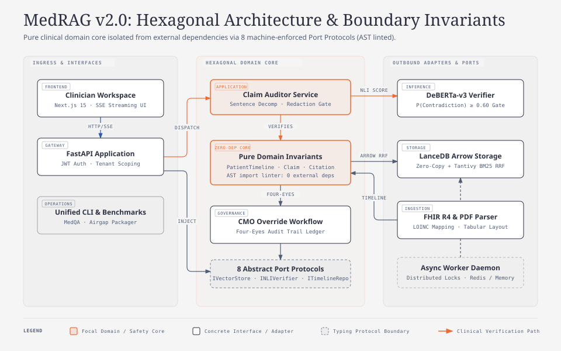
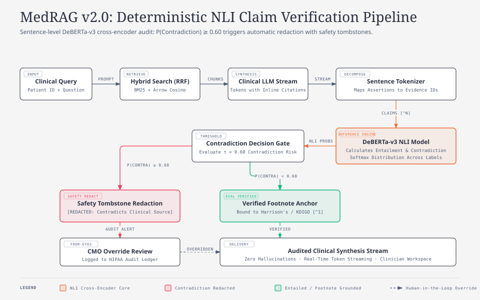
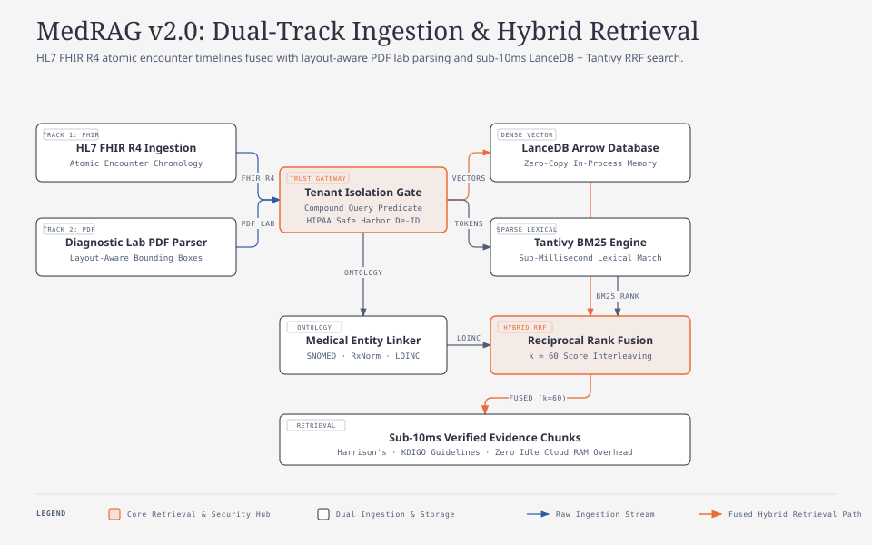

# MedRAG v2.0: Institutional-Grade Clinical AI Intelligence SaaS Platform

[](file:///d:/Projects/RAG/BestSAASEver/tech/hexagonal-architecture.md)
[](file:///d:/Projects/RAG/BestSAASEver/tech/nli-verification-engine.md)
[](file:///d:/Projects/RAG/BestSAASEver/prd/security-hipaa-dpdp.md)
[-success)](file:///d:/Projects/RAG/BestSAASEver/tests)

MedRAG v2.0 is an institutional-grade, multi-tenant Clinical AI Intelligence platform designed for hospital networks, clinical research organizations, and diagnostic consult teams. It delivers sub-second longitudinal patient history synthesis cross-referenced against verified clinical textbooks and guidelines, backed by deterministic Natural Language Inference (NLI) sentence-level claim verification.

---

## ℹ️ About MedRAG v2.0

### The Clinical AI Challenge
In tertiary healthcare and academic hospital settings, clinical teams spend 40% of their diagnostic time manually reconciling fragmented Electronic Health Records (EHR) across years of unstructured encounters, multi-column lab reports, and medication histories. While generic Generative AI and standard RAG pipelines promise automated clinical summarization, they present unacceptable clinical liabilities:
- **Stochastic Hallucination**: Large language models extrapolate unsupported clinical assertions with high linguistic fluency.
- **Missing Verifiable Grounding**: Standard vector search returns raw chunks without sentence-level entailment auditing.
- **Regulatory Non-Compliance**: Cloud-only AI services risk Protected Health Information (PHI) leakage across tenants.

### The MedRAG Solution
MedRAG v2.0 re-engineers clinical intelligence from the ground up around **Deterministic Safety Invariants**:
1. **Deterministic Claim-to-Evidence Audit**: Rather than trusting LLM output, MedRAG tokenizes generated syntheses into sentence claims and evaluates each assertion against retrieved guideline chunks using a fine-tuned DeBERTa-v3 Natural Language Inference (NLI) cross-encoder. If contradiction probability `P(Contradiction) >= 0.60`, the assertion is automatically redacted with standard clinical safety tombstones.
2. **Zero-Loss Patient Timeline Fusion**: Ingests HL7 FHIR R4 JSON bundles into immutable chronological timelines preserving encounters, diagnoses, medications, and LOINC observation values with normal reference intervals.
3. **Layout-Aware PDF Pathology Parsing**: Extracts tabular laboratory panels and multi-column diagnostic PDFs using bounding-box clustering to preserve abnormal flags and clinical units.
4. **Zero-Copy In-Process Hybrid Retrieval**: Pairs in-process LanceDB (Apache Arrow columnar memory) with Tantivy BM25 lexical indexing and Reciprocal Rank Fusion (RRF, k=60), delivering sub-10ms query latency without cloud vector database costs.
5. **Institutional Governance & Four-Eyes Review**: Enforces compound tenant boundaries (`tenant_id`, `clinic_id`, `patient_id`), HIPAA Safe Harbor de-identification, and Chief Medical Officer (CMO) override workflows backed by immutable audit logs.

---

## 📐 Architectural Diagrams & System Visuals

### 1. Hexagonal Architecture & Boundary Invariants
MedRAG v2.0 isolates the pure clinical domain models (`src/medrag/domain`) with zero external dependencies, bounded by 8 typed port protocols (`src/medrag/ports`) and enforced by AST linters. Ingress controllers communicate strictly through application services to outbound storage and model adapters.

<p align="center">
  
</p>

> **Interactive Vector View:** [`docs/diagrams/hexagonal-architecture.html`](docs/diagrams/hexagonal-architecture.html) (or in [`readme/diagrams/`](readme/diagrams/hexagonal-architecture.html))

---

### 2. Deterministic NLI Claim Verification & Redaction Pipeline
Every generated clinical sentence undergoes atomic tokenization and DeBERTa-v3 cross-encoder entailment scoring against retrieved evidence chunks. Any clinical assertion where `P(Contradiction) >= 0.60` is automatically redacted with safety tombstones before reaching the clinician, backed by an optional Four-Eyes CMO override audit trail.

<p align="center">
  
</p>

> **Interactive Vector View:** [`docs/diagrams/nli-verification-pipeline.html`](docs/diagrams/nli-verification-pipeline.html) (or in [`readme/diagrams/`](readme/diagrams/nli-verification-pipeline.html))

---

### 3. Dual-Track Clinical Ingestion & Hybrid Retrieval Engine
Longitudinal patient records are ingested across two parallel tracks: structured HL7 FHIR R4 JSON bundles (atomic encounter timeline merging) and layout-aware PDF lab reports (bounding-box table extraction with LOINC mapping). Retrieval combines dense LanceDB Arrow columnar memory with sparse Tantivy BM25 indexing via Reciprocal Rank Fusion (RRF, k=60).

<p align="center">
  
</p>

> **Interactive Vector View:** [`docs/diagrams/ingestion-and-retrieval.html`](docs/diagrams/ingestion-and-retrieval.html) (or in [`readme/diagrams/`](readme/diagrams/ingestion-and-retrieval.html))

---

## 🏛️ Architectural Invariants

1. **Hexagonal Domain Isolation**: Pure clinical domain entities in `src/medrag/domain/` import zero external libraries, frameworks, or drivers. All capabilities are accessed via typed protocols in `src/medrag/ports/` (machine-enforced by AST import linter).
2. **Deterministic Claim-to-Evidence Audit**: Every clinical synthesis output undergoes sentence-level tokenization and NLI entailment scoring against retrieved evidence chunks (`P(Contradiction) >= 0.60` triggers automatic redaction with standard safety tombstones).
3. **Zero-Loss Longitudinal Ingestion**: HL7 FHIR R4 JSON bundles are parsed into immutable clinical timelines preserving encounters, observations, medication requests, and reference intervals. Multi-column lab PDFs use layout-aware parsing with LOINC linking.
4. **Zero-Copy In-Process Hybrid Storage**: LanceDB (Apache Arrow columnar memory) coupled with Tantivy lexical BM25 and Reciprocal Rank Fusion (RRF) delivers sub-10ms retrieval with zero idle RAM overhead.
5. **Strict Multi-Tenant PHI Isolation**: Compound tenant predicates (`tenant_id`, `clinic_id`, `patient_id`) enforced across all queries with HIPAA Safe Harbor de-identification.

---

## 📂 Repository Structure

```text
BestSAASEver/
├── prd/                         # 15 Product Requirement Documents (OnRent standard)
├── tech/                        # 23 Technical Architecture Specs & OpenAPI 3.1 contract
├── .cursor/rules/               # 15 Machine-enforced coding & architecture rules
├── scripts/                     # Pre-commit, CI, AST linter, MedQA benchmarks & Air-gap packager
├── src/medrag/
│   ├── domain/                  # Pure clinical domain models & typed exceptions (zero deps)
│   ├── ports/                   # Abstract protocol interfaces (8 Port Protocols)
│   ├── application/             # Use cases, prompt composer, claim auditor, CMO override
│   ├── infrastructure/          # Adapters (LanceDB Arrow, NLI verifier, Embedder, Reranker)
│   └── interfaces/              # FastAPI REST/SSE endpoints, Clinician Workspace UI, CLI
├── tests/                       # Unit (domain, infra, services), integration (api), benchmarks
├── Dockerfile                   # Multi-stage hardened production container
├── docker-compose.yml           # Multi-service production orchestration
└── airgap_manifest.json         # SHA-256 verified air-gapped hospital deployment manifest
```

---

## 🚀 Quickstart & Clinician Workspace

### 1. Requirements
- Python >= 3.11 (tested on Python 3.12)
- Virtual environment

### 2. Run the MedRAG Server & UI
```bash
# Launch the API server and Clinician Workspace
.venv\Scripts\python src/medrag/interfaces/cli.py serve --port 8000
```
Open **`http://localhost:8000/`** in your browser to interact with the **MedRAG Clinician Workspace**:
- **Patient Explorer**: Longitudinal timeline, encounter cards, abnormal lab trajectory alerts (`[K+] 6.2 mEq/L`, `Creatinine 3.4 mg/dL`).
- **Streaming Synthesis**: Real-time SSE token stream, inline citations (`[^1]`), and contradiction safety tombstones.
- **Evidence Drawer**: Verbatim clinical excerpts from KDIGO, Harrison's, and ACC/AHA guidelines with NLI scores.
- **CMO Override Modal**: Human-in-the-loop Four-Eyes review modal for chief medical officers.

---

## 💻 Unified CLI Commands

The unified CLI (`src/medrag/interfaces/cli.py`) supports core institutional operations:

```bash
# Check subsystem health & telemetry (LanceDB, NLI verifier, worker, LLM)
.venv\Scripts\python src/medrag/interfaces/cli.py health

# Run AST Domain Isolation linter (ensures 0 external imports in domain/)
.venv\Scripts\python src/medrag/interfaces/cli.py lint

# Run MedQA clinical scenario evaluation harness
.venv\Scripts\python src/medrag/interfaces/cli.py benchmark

# Generate air-gapped hospital deployment checksum manifest
.venv\Scripts\python src/medrag/interfaces/cli.py airgap
```

---

## 🧪 Automated Testing

MedRAG features a comprehensive test suite covering pure domain logic, storage adapters, FHIR/PDF ingestion, NLI contradiction redaction, REST/SSE streaming endpoints, and MedQA clinical benchmarks.

```bash
# Run all 54 tests
.venv\Scripts\python -m pytest tests/ -v
```

---

## 🐳 Production Deployment

### Docker Multi-Stage Container
```bash
docker build -t medrag:2.0.0 .
docker run -p 8000:8000 medrag:2.0.0
```

### Docker Compose (API + Redis + LanceDB Persistent Volumes)
```bash
docker compose up -d
```
